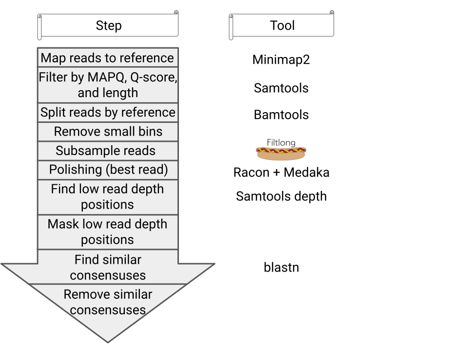
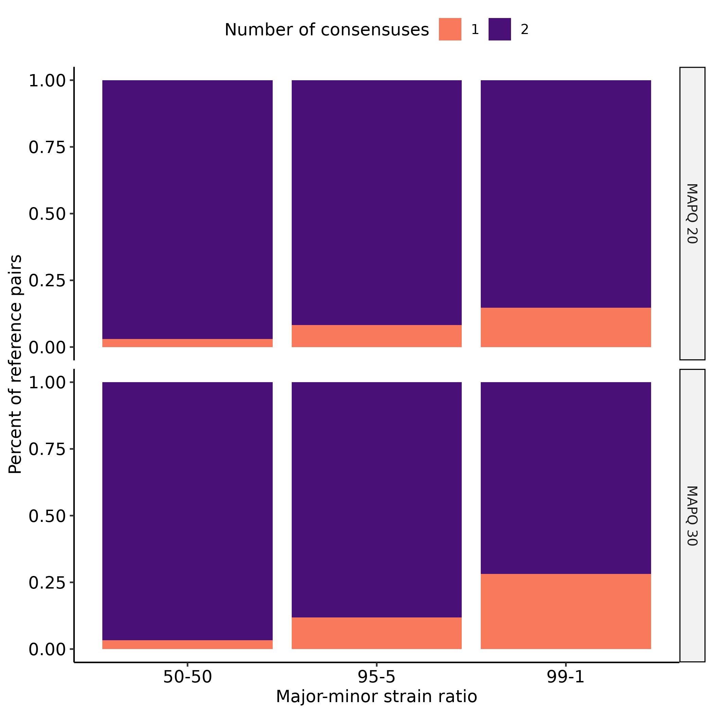
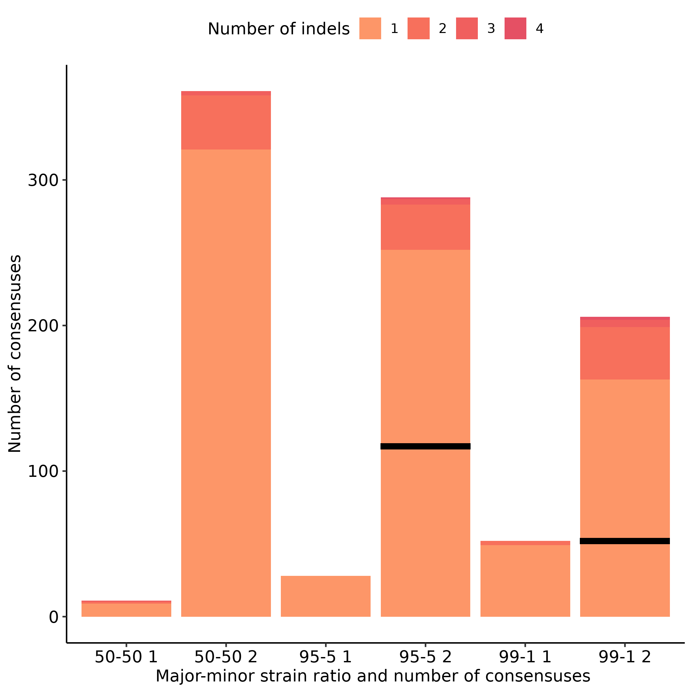

## Co-infection detection scripts ##
          
This pipeline detects co-infections in Nanopore reads using a database
 of references. The references should be a region of the genome with high
 variation, instead of the full genome. The references that have mapped reads
 will be split into bins. Each bin is polished to make a consensus for each
 sequence in the co-infection. For a flow chart of all steps see figure 1.

The consensuses can be longer than the region provided, allowing for a region 
 of 600 to 700 bp to bin reads from larger, 2kb amplicons. However, the pipeline
 does not guarantee that a read covering the entire 2kb region will be used in
 the polishing step. So, some manual steps may be needed if the user wants
 longer regions. We hope to fix this limitation by having the user provide
 a whole genome and the pipeline selecting the reads with the longest aligned 
 lengths to the provided reference. No guarantees that it will be fixed.

### How to run ###

bash findCoInfections.sh -i reads.fastq -r references.fasta [options ...]

Some options you may be likely to change:

1. -p: prefix to call the output
2. -a: min read length to keep (also min aligned length for blastn)
3. -n: max read length to keep
4. -m: model to used to basecall the reads (currently r941_min_high_g351)
5. -t: number of threads to use
6. -h: print out all parameters you can change (help message)

### How the pipeline works ###

<figure>
    
    <figcaption>
      <em>
        <b>Figure 1:</b> Flow chart showing each step in our pipeline.
      </em>
    </figcaption>
<figure>
    
&nbsp;
    
### Performance ###

We tested our pipeline by simulating reads from 237 pairs of porcine circovirus
 type 2 capsid genes, which are roughly 700bp long. Each pair of capsid genes
 were from a single subtype and were 98% to 98.5% similar to each other. We had
 multiple capsid gene pairs for each subtype. Reads were simulated with badread,
 using a mean accuracy of 90% and 20000x read depth. We simulated reads for
 co-infections by having the minor strain produce 50%, 5%, and 1% of reads.

command line: 

```
bash findCoInfections.sh \
	-f reads.fastq \
	-r capsid.fasta \
	-p prefix \
	-Q 20 or 30 \
	-x 0 \
	-g 1 \
	-K 0;
```

<figure>                             <!--make a figure-->
    <image src="figures/Num-con-graph.png" 
       width=50%
       height=50%
    >
    <figcaption>             <!--Add a caption to the figure-->
      <em>                   <!--<em> for italics, <b> for bold-->
        <b>Figure 2:</b>
        Number of co-infections detected for each reference pair.
      </em>
    </figcaption>
</figure>
    
&nbsp; <!--Add an empty line-->
    
We found that our initial settings detected co-infections at least half of the
 time (Figure 2). However, some of time we missed co-infections or detected
 extra co-infections, which were from noisy reads (Figure 2). The number of
 missed co-infections or extra co-infections increased as the percentage of
 reads from the minor variant decreased (Figure 2).

&nbsp; <!--Add an empty line-->
    
<figure>
    
    <figcaption>
        <em>
          <b>Figure 3:</b> Number of co-infections detected for each reference
          pair when we require at least 100 reads per consensus and a minimum
          differnce of 0.3% mismatches between all consensus.
         </em>
    <figcaption>
</figure>
    
&nbsp;
        
We simulated what would happen if we had removed bins will less then 100 reads
 and consensus genomes with fewere than 0.3% of mismatches in R. To simulate the
 percent of mismatches between consensus genomes mapping to the same reference
 we multiplied the number of mismatches for the most error prone consensus
 genome in a reference pair by 2.

We found that removing bins with 100 reads combined with removing consensus
 genomes with less then 0.3% mismatches removed all noise (extra co-infections),
 while having only a slight increase in missed co-infections (Figure 3). Also, a
 MAPQ of 20 detected more co-infections then a MAPQ of 30 (figure 3).

### Accuracy ###

<figure>
   <!--image settings-->
  <figcaption>
    <em>
      <b>Figure 4:</b> Number of consensuses with at least one mismatch. The
      horizontal bar shows the number of consensuses from minor variants when
      95% or 99% of reads were from the major variant. The number of consensus
      detected in each consensuses pair is shown on the x-axis as 1 or 2. The
      high error rate in the 99% major reference point that detected one
      consensus had aggressive filtering on the major variant. Resulting, in
      the bin with the most reads having 677 reads from the major strain and
      272 reads from the minor strain.
    </em>
  </figcaption>
<figure>

&nbsp;

We looked at the error rate in our consensuses by looking at the number of
 indels (figure 5) and the number of mismatches (figure 4) in each consensus.
 We found that mismatches were rare (13 out of 237 consensuses). Half of 
 the consensus with mismatches were from reference pairs that detected only one
 variant and had 50% of reads from the minor variant (50-50 1, figure 4).

The consensuses from the 50-50 1 reference pairs are almost the only consensus 
 with mismatches from reference pairs that detected only one consensus
 (figure 4). The only exception is one case that had 99% of reads from the
 major consensus (99-1 1, figure 4). However, in the 99-1 1 case the major
 variant lost most of its reads to aggressive filtering, resulting in the minor
 variant having 28% (272) of reads. So, the 99-1 1 case is more like the
 50-50 1 case. In both cases, mismatches are likely from the polisher merging
 both variants into one consensus.

A quarter of consensuses with mismatches were from consensus pairs that
 detected two variants and had 99% of reads from the major variant 
 (99-1 2, Figure 4). All 99-1 2 consensuses with mismatches were from the minor
 variant (Figure 4.). In some cases the minor variant had fewer than 200 reads
 in a bin and had some misbinned, noisy reads from the major variant.
 Allowing, either lower read depth or merging of two variants to have increased
 the number of mismatches in the minor variant.
 

<figure>
     <!--img: insert the indel graph image-->
    <figcaption>
      <em> <!--start italics-->
        <b>Figure 5:</b>  Number of consensuses with at least one indel. The
        horizontal bar shows the number of consensuses from minor variants when
        95% or 99% of reads were from the major variant. The number of
        consensus detected in each consensuses pair is shown on the x-axis as 
        1 or 2.
      </em> <!--end italics--> 
    </figcaption>
</figure>

&nbsp;

We found that most consensuses (300 of 474) had at least one indel when the 
 the minor variant contributed 50% of reads (Figure 5). Most of the difference
 between the different ratios of major and minor variants were due to an
 increase in the number of times one co-infection was missed (Figure 5). The
 missed co-infections reduced the number of minor variant consensuses,
 resulting in a lower counts.

### Some future questions and directions ###

1. Only do the % similarity and % mismatch checks between consensus genomes on
   the region of interest. Right know it does these checks on the entire
   consensus.
2. Use a full genome reference to detect and use longer reads for polishing.
